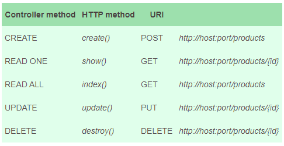

## JavaLite

# 1. Introdução
JavaLite é uma coleção de estruturas para simplificar tarefas comuns com as quais todo desenvolvedor deve lidar ao construir aplicativos.

Neste tutorial, vamos dar uma olhada nos recursos JavaLite focados na construção de uma API simples.

# 2. Configuração
Ao longo deste tutorial, criaremos um aplicativo RESTful CRUD simples. Para fazer isso, usaremos ActiveWeb e ActiveJDBC - duas das estruturas com as quais o JavaLite se integra.

Então, vamos começar e adicionar a primeira dependência de que precisamos:

```
<dependency>
    <groupId>org.javalite</groupId>
    <artifactId>activeweb</artifactId>
    <version>1.15</version>
</dependency>
```

O artefato ActiveWeb inclui ActiveJDBC, portanto, não há necessidade de adicioná-lo separadamente. Observe que a versão mais recente do activeweb pode ser encontrada no Maven Central.

A segunda dependência de que precisamos é um conector de banco de dados. Para este exemplo, vamos usar o MySQL, portanto, precisamos adicionar:

```
<dependency>
    <groupId>mysql</groupId>
    <artifactId>mysql-connector-java</artifactId>
    <version>5.1.45</version>
</dependency>
```

Novamente, a dependência mysql-connector-java mais recente pode ser encontrada no Maven Central.

A última dependência que temos que adicionar é algo específico para JavaLite:

```
<plugin>
    <groupId>org.javalite</groupId>
    <artifactId>activejdbc-instrumentation</artifactId>
    <version>1.4.13</version>
    <executions>
        <execution>
            <phase>process-classes</phase>
            <goals>
                <goal>instrument</goal>
            </goals>
        </execution>
    </executions>
</plugin>
```

O plugin de instrumentação activejdbc mais recente também pode ser encontrado no Maven Central.

Tendo tudo isso instalado e antes de começar com entidades, tabelas e mapeamentos, vamos nos certificar de que um dos bancos de dados suportados está instalado e funcionando. Como dissemos antes, usaremos o MySQL.

Agora estamos prontos para começar com o mapeamento relacional de objetos.

# 3. Mapeamento Objeto-Relacional

### 3.1. Mapeamento e Instrumentação
Vamos começar criando uma classe Product que será nossa entidade principal:

```
public class Product {}
```

E, também vamos criar a tabela correspondente para ele:

```
CREATE TABLE PRODUCTS (
    id int(11) DEFAULT NULL auto_increment PRIMARY KEY,
    name VARCHAR(128)
);
```

Finalmente, podemos modificar nossa classe Product para fazer o mapeamento:

```
public class Product extends Model {}
```

Precisamos apenas estender a classe org.javalite.activejdbc.Model. ActiveJDBC infere parâmetros de esquema de banco de dados do banco de dados. Graças a esse recurso, não há necessidade de adicionar getters e setters ou qualquer anotação.

Além disso, o ActiveJDBC reconhece automaticamente que a classe Product precisa ser mapeada para a tabela PRODUCTS. Ele faz uso de inflexões do inglês para converter a forma singular de um modelo em uma forma plural de uma tabela. E sim, funciona com exceções também.

Há uma última coisa de que precisaremos para fazer nosso mapeamento funcionar: instrumentação. Instrumentação é uma etapa extra exigida pelo ActiveJDBC que nos permitirá brincar com nossa classe Product como se ela tivesse getters, setters e métodos do tipo DAO.

Depois de executar a instrumentação, seremos capazes de fazer coisas como:

```
Product p = new Product();
p.set("name","Bread");
p.saveIt();
```

ou:

```
List<Product> products = Product.findAll();
```

É aqui que entra o plugin activejdbc-instrumentation. Como já temos a dependência em nosso pom, devemos ver as classes sendo instrumentadas durante a construção:

```
...
[INFO] --- activejdbc-instrumentation:1.4.11:instrument (default) @ javalite ---
**************************** START INSTRUMENTATION ****************************
Directory: ...\tutorials\java-lite\target\classes
Instrumented class: .../tutorials/java-lite/target/classes/app/models/Product.class
**************************** END INSTRUMENTATION ****************************
...
```

A seguir, criaremos um teste simples para ter certeza de que está funcionando.


### 3.2. Testando
Finalmente, para testar nosso mapeamento, seguiremos três etapas simples: abra uma conexão com o banco de dados, salve um novo produto e recupere-o:


```
@Test
public void givenSavedProduct_WhenFindFirst_ThenSavedProductIsReturned() {
    
    Base.open(
      "com.mysql.jdbc.Driver",
      "jdbc:mysql://localhost/dbname",
      "user",
      "password");

    Product toSaveProduct = new Product();
    toSaveProduct.set("name", "Bread");
    toSaveProduct.saveIt();

    Product savedProduct = Product.findFirst("name = ?", "Bread");

    assertEquals(
      toSaveProduct.get("name"), 
      savedProduct.get("name"));
}
```

Observe que tudo isso (e muito mais) é possível tendo apenas um modelo e instrumentação vazios.

# 4. Controladores
Agora que nosso mapeamento está pronto, podemos começar a pensar sobre nosso aplicativo e seus métodos CRUD.

Para isso, vamos utilizar controladores que processam requisições HTTP.

Vamos criar nosso ProductsController:

```
@RESTful
public class ProductsController extends AppController {

    public void index() {
        // ...
    }

}
```

Com essa implementação, o ActiveWeb mapeará automaticamente o método index() para o seguinte URI:

```
http://<host>:<port>/products
```

Os controladores anotados com @RESTful fornecem um conjunto fixo de métodos mapeados automaticamente para diferentes URIs. Vamos ver aqueles que serão úteis para o nosso exemplo CRUD:



E se adicionarmos este conjunto de métodos ao nosso ProductsController:

```
@RESTful
public class ProductsController extends AppController {

    public void index() {
        // code to get all products
    }

    public void create() {
        // code to create a new product
    }

    public void update() {
        // code to update an existing product
    }

    public void show() {
        // code to find one product
    }

    public void destroy() {
        // code to remove an existing product 
    }
}
```

Antes de prosseguir para nossa implementação lógica, daremos uma olhada rápida em algumas coisas que precisamos configurar.

# 5. Configuração
O ActiveWeb é baseado principalmente em convenções, a estrutura do projeto é um exemplo disso. Os projetos ActiveWeb precisam seguir um layout de pacote predefinido:

```
src
 |----main
       |----java.app
       |     |----config
       |     |----controllers
       |     |----models
       |----resources
       |----webapp
             |----WEB-INF
             |----views
```

Há um pacote específico que precisamos dar uma olhada - app.config.

Dentro desse pacote, vamos criar três classes:

```
public class DbConfig extends AbstractDBConfig {
    @Override
    public void init(AppContext appContext) {
        this.configFile("/database.properties");
    }
}
```

Esta classe configura conexões de banco de dados usando um arquivo de propriedades no diretório raiz do projeto contendo os parâmetros necessários:

```
development.driver=com.mysql.jdbc.Driver
development.username=user
development.password=password
development.url=jdbc:mysql://localhost/dbname
```

Isso criará a conexão automaticamente substituindo o que fizemos na primeira linha de nosso teste de mapeamento.

A segunda classe que precisamos incluir dentro do pacote app.config é:

```
public class AppControllerConfig extends AbstractControllerConfig {
 
    @Override
    public void init(AppContext appContext) {
        add(new DBConnectionFilter()).to(ProductsController.class);
    }
}
```

Este código vinculará a conexão que acabamos de configurar ao nosso controlador.

A terceira classe irá configurar o contexto do nosso aplicativo:

```
public class AppBootstrap extends Bootstrap {
    public void init(AppContext context) {}
}
```

Depois de criar as três classes, a última coisa em relação à configuração é criar nosso arquivo web.xml no diretório webapp / WEB-INF:

```
<?xml version="1.0" encoding="UTF-8"?>
<web-app xmlns=...>

    <filter>
        <filter-name>dispatcher</filter-name>
        <filter-class>org.javalite.activeweb.RequestDispatcher</filter-class>
        <init-param>
            <param-name>exclusions</param-name>
            <param-value>css,images,js,ico</param-value>
        </init-param>
        <init-param>
            <param-name>encoding</param-name>
            <param-value>UTF-8</param-value>
        </init-param>
    </filter>

    <filter-mapping>
        <filter-name>dispatcher</filter-name>
        <url-pattern>/*</url-pattern>
    </filter-mapping>

</web-app>
```

Agora que a configuração está feita, podemos prosseguir e adicionar nossa lógica.

# 6. Implementação da lógica CRUD
Com os recursos semelhantes a DAO fornecidos por nossa classe de produto, é muito simples adicionar a funcionalidade CRUD básica:

```
@RESTful
public class ProductsController extends AppController {

    private ObjectMapper mapper = new ObjectMapper();    

    public void index() {
        List<Product> products = Product.findAll();
        // ...
    }

    public void create() {
        Map payload = mapper.readValue(getRequestString(), Map.class);
        Product p = new Product();
        p.fromMap(payload);
        p.saveIt();
        // ...
    }

    public void update() {
        Map payload = mapper.readValue(getRequestString(), Map.class);
        String id = getId();
        Product p = Product.findById(id);
        p.fromMap(payload);
        p.saveIt();
        // ...
    }

    public void show() {
        String id = getId();
        Product p = Product.findById(id);
        // ...
    }

    public void destroy() {
        String id = getId();
        Product p = Product.findById(id);
        p.delete();
        // ...
    }
}
```

Fácil, certo? No entanto, isso não está retornando nada ainda. Para fazer isso, temos que criar algumas visualizações.

# 7. Visualizações
ActiveWeb usa FreeMarker como um mecanismo de modelagem, e todos os seus modelos devem estar localizados em src / main / webapp / WEB-INF / views.

Dentro desse diretório, colocaremos nossas visualizações em uma pasta chamada produtos (igual ao nosso controlador). Vamos criar nosso primeiro modelo chamado _product.ftl:

```
{
    "id" : ${product.id},
    "name" : "${product.name}"
}
```

Está bem claro neste ponto que esta é uma resposta JSON. Claro, isso só funcionará para um produto, então vamos continuar e criar outro modelo chamado index.ftl:

```
[<@render partial="product" collection=products/>]
```

Isso basicamente renderizará uma coleção de produtos nomeados, com cada um formatado por _product.ftl.

Finalmente, precisamos vincular o resultado de nosso controlador à visualização correspondente:

```
@RESTful
public class ProductsController extends AppController {

    public void index() {
        List<Product> products = Product.findAll();
        view("products", products);
        render();
    }

    public void show() {
        String id = getId();
        Product p = Product.findById(id);
        view("product", p);
        render("_product");
    }
}
```

No primeiro caso, estamos atribuindo uma lista de produtos à nossa coleção de modelos chamada também produtos.

Então, como não estamos especificando nenhuma visão, index.ftl será usado.

No segundo método, estamos atribuindo product p ao elemento product na view e estamos dizendo explicitamente qual view renderizar.

Também poderíamos criar uma view message.ftl:

```
{
    "message" : "${message}",
    "code" : ${code}
}
```

E, em seguida, chame-o de qualquer um dos métodos do nosso ProductsController:

```
view("message", "There was an error.", "code", 200);
render("message");
```

Vamos agora ver nosso ProductController final:

```
@RESTful
public class ProductsController extends AppController {

    private ObjectMapper mapper = new ObjectMapper();

    public void index() {
        view("products", Product.findAll());
        render().contentType("application/json");
    }

    public void create() {
        Map payload = mapper.readValue(getRequestString(), Map.class);
        Product p = new Product();
        p.fromMap(payload);
        p.saveIt();
        view("message", "Successfully saved product id " + p.get("id"), "code", 200);
        render("message");
    }

    public void update() {
        Map payload = mapper.readValue(getRequestString(), Map.class);
        String id = getId();
        Product p = Product.findById(id);
        if (p == null) {
            view("message", "Product id " + id + " not found.", "code", 200);
            render("message");
            return;
        }
        p.fromMap(payload);
        p.saveIt();
        view("message", "Successfully updated product id " + id, "code", 200);
        render("message");
    }

    public void show() {
        String id = getId();
        Product p = Product.findById(id);
        if (p == null) {
            view("message", "Product id " + id + " not found.", "code", 200);
            render("message");
            return;
        }
        view("product", p);
        render("_product");
    }

    public void destroy() {
        String id = getId();
        Product p = Product.findById(id);
        if (p == null) {
            view("message", "Product id " + id + " not found.", "code", 200);
            render("message");
            return;
        }
        p.delete();
        view("message", "Successfully deleted product id " + id, "code", 200);
        render("message");
    }

    @Override
    protected String getContentType() {
        return "application/json";
    }

    @Override
    protected String getLayout() {
        return null;
    }
}

```

Neste ponto, nosso aplicativo está pronto e estamos prontos para executá-lo.

# 8. Executando o aplicativo
Usaremos o plugin Jetty:

```
<plugin>
    <groupId>org.eclipse.jetty</groupId>
    <artifactId>jetty-maven-plugin</artifactId>
    <version>9.4.8.v20171121</version>
</plugin>
```

Encontre o último plugin jetty-maven no Maven Central.

E estamos prontos, podemos executar nosso aplicativo:

```
mvn jetty:run
```

Vamos criar alguns produtos:

```
$ curl -X POST http://localhost:8080/products 
  -H 'content-type: application/json' 
  -d '{"name":"Water"}'
{
    "message" : "Successfully saved product id 1",
    "code" : 200
}
```

```
$ curl -X POST http://localhost:8080/products 
  -H 'content-type: application/json' 
  -d '{"name":"Bread"}'
{
    "message" : "Successfully saved product id 2",
    "code" : 200
}
```

... Leia-os:

```
$ curl -X GET http://localhost:8080/products
[
    {
        "id" : 1,
        "name" : "Water"
    },
    {
        "id" : 2,
        "name" : "Bread"
    }
]
```

... atualize um deles:

```
$ curl -X PUT http://localhost:8080/products/1 
  -H 'content-type: application/json' 
  -d '{"name":"Juice"}'
{
    "message" : "Successfully updated product id 1",
    "code" : 200
}
```

… Leia o que acabamos de atualizar:

```
$ curl -X GET http://localhost:8080/products/1
{
    "id" : 1,
    "name" : "Juice"
}
```

Finalmente, podemos excluir um:

```
$ curl -X DELETE http://localhost:8080/products/2
{
    "message" : "Successfully deleted product id 2",
    "code" : 200
}
```

# 9. Conclusão

JavaLite tem muitas ferramentas para ajudar os desenvolvedores a colocar um aplicativo em execução em minutos. No entanto, embora basear as coisas em convenções resultem em um código mais limpo e simples, leva um tempo para entender a nomenclatura e a localização de classes, pacotes e arquivos.

Esta foi apenas uma introdução ao ActiveWeb e ActiveJDBC.